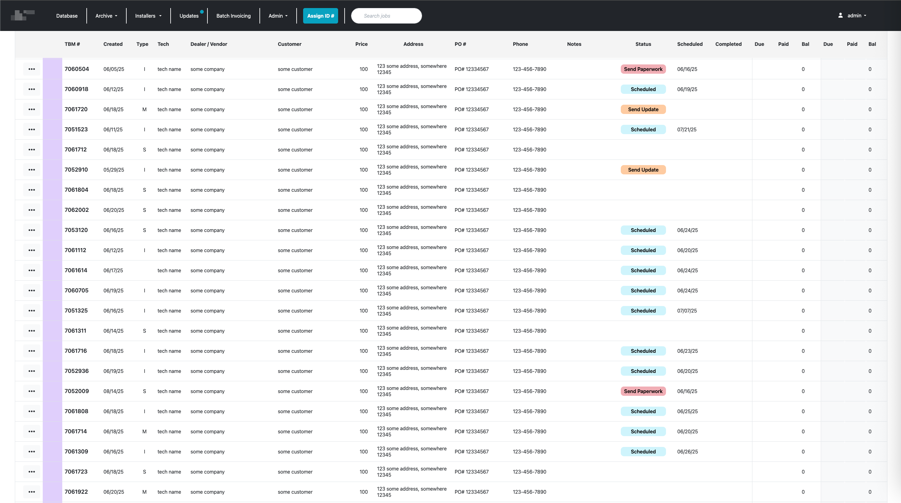
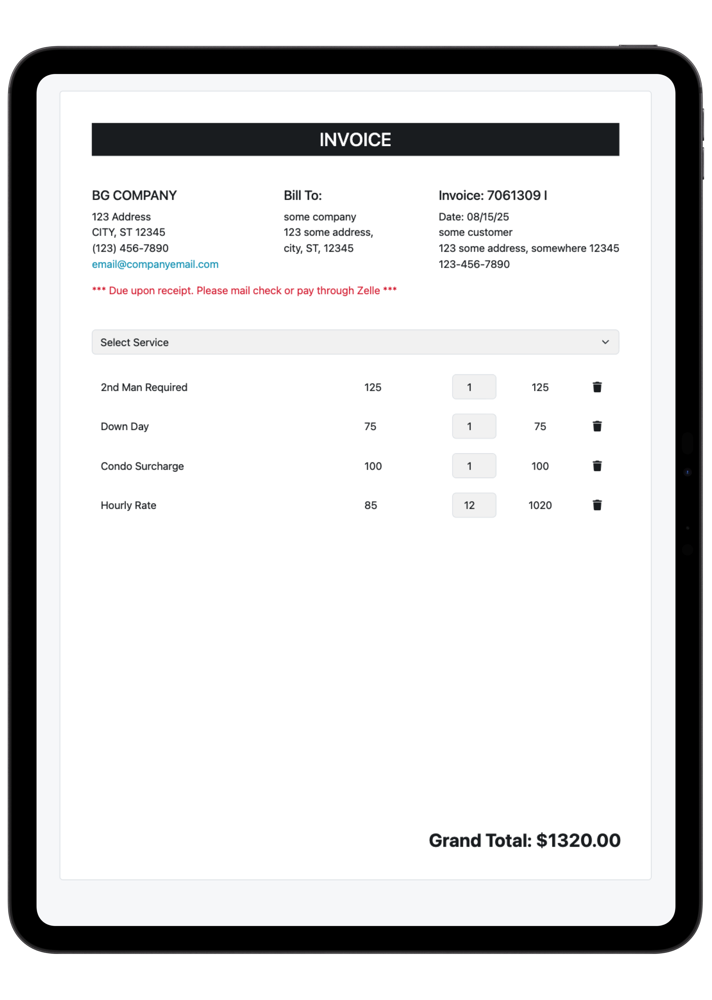
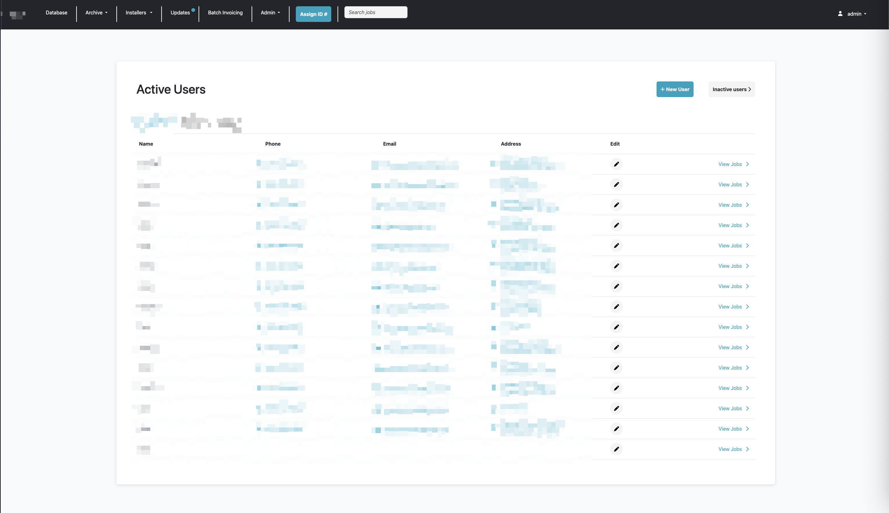
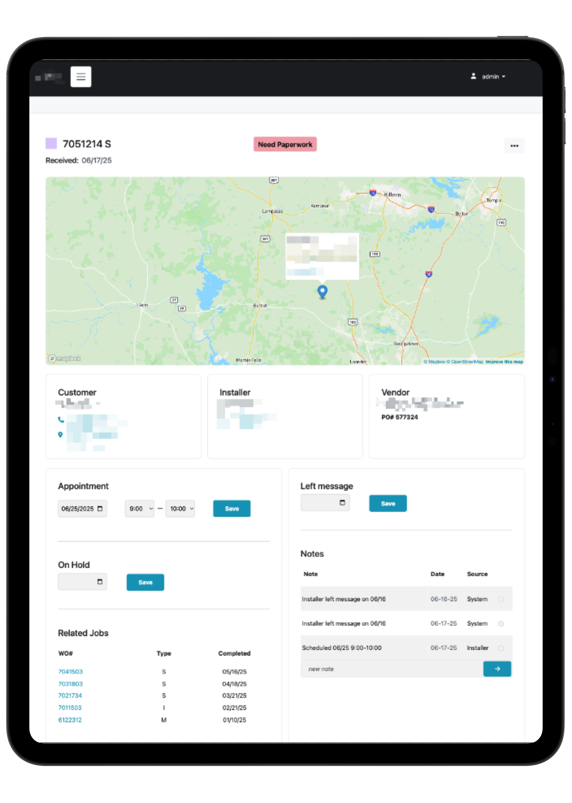

# business-portal-readme

Business portal I built for a contract job I took. Features include :

 # Business Portal

 This business portal was developed for a contract client and includes the following features :
 - Integrated database
 - User management
 - Invoice creation system
 - Work order workflows
 - Maps integration, tap-to-call phone numbers, and emails
 - Notes system for communication between vendors, dealers, contractors, and office staff

 ## Screenshots

 **Database**
 

 **Invoice Screen**
 

 **Jobs List**
 

 **Users Management**
 

 **Work Order**
 