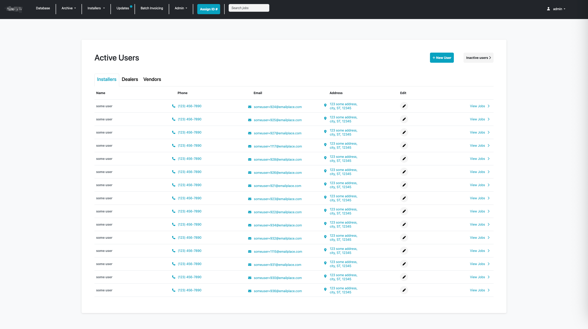

 # Business Portal

 This business portal was developed for a contract client and includes the following :
 - Integrated database
 - User management
 - Invoice creation system
 - Work order management/flows
 - Maps integration, tap-to-call phone numbers, and emails
 - Notes system for communication between vendors, dealers, contractors, and office staff.

 ## Tech Stack

- **Backend:** Spring Boot/Java
- **Frontend:** Thymeleaf (server-side rendering), JavaScript, jQuery
- **Database:** PostgreSQL
- **Hosting:** Heroku

 ## Screenshots

 **Database**
 

  **Users Management**
 
 
<table>
    <tr>
        <td align="center"><b>Field List</b> </td>
        <td align="center"><b>Work Order</b> </td>
        <td align="center"><b>Invoice Creator</b> </td>
    </tr>
</table>
